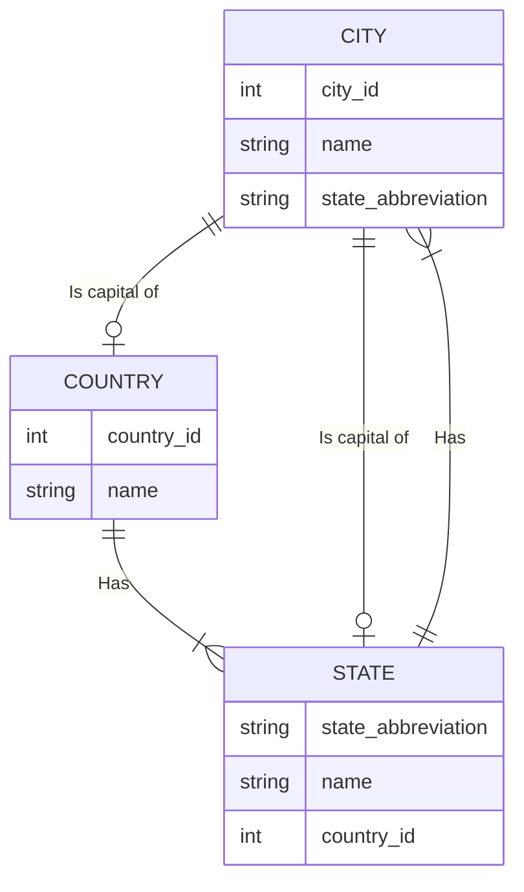

# ERD

```mermaid
erDiagram
    CITY {
        int city_id
        string name
        string state_abbreviation
    }
    STATE {
        string state_abbreviation
        string name
        int country_id
    }
    COUNTRY {
        int country_id
        string name
    }
    COUNTRY ||--|{ STATE : "Has"
    STATE ||--|{ CITY : "Has"
    CITY ||--o| STATE : "Is capital of"
    CITY ||--o| COUNTRY : "Is capital of"
```
