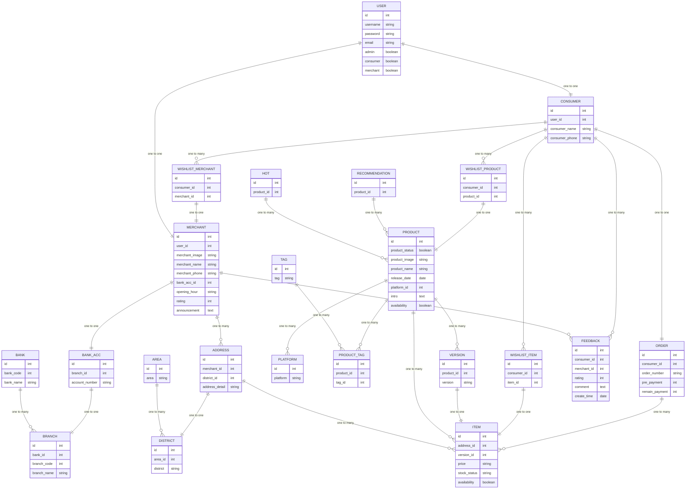

# ERD

```mermaid
erDiagram
    USER {
        id int
        username string
        password string
        email string
        admin boolean
        consumer boolean
        merchant boolean
    }
    MERCHANT {
        id int
        user_id int
        merchant_image string
        merchant_name string
        merchant_phone string
        bank_acc_id int
        opening_hour string
        rating int
        announcement text
    }
    ADDRESS {
        id int
        merchant_id int
        district_id int
        address_detail string
    }
    DISTRICT {
        id int
        area_id int
        district string
    }
    AREA {
        id int
        area string
    }
    BANK_ACC {
        id int
        branch_id int
        account_number string
    }
    BRANCH {
        id int
        bank_id int
        branch_code int
        branch_name string
    }
    BANK {
        id int
        bank_code int
        bank_name string
    }
    PRODUCT {
        id int
        product_status boolean
        product_image string
        product_name string
        release_date date
        platform_id int
        intro text
        availability boolean
    }
    PLATFORM {
        id int
        platform string
    }
    TAG {
        id int
        tag string
    }
    PRODUCT_TAG {
        id int
        product_id int
        tag_id int
    }
    VERSION {
        id int
        product_id int
        version string
    }
    ITEM {
        id int
        address_id int
        version_id int
        price string
        stock_status string
        availability boolean
    }
    RECOMMENDATION {
        id int
        product_id int
    }
    HOT {
        id int
        product_id int
    }
    WISHLIST_MERCHANT {
        id int
        consumer_id int
        merchant_id int
    }
    WISHLIST_PRODUCT {
        id int
        consumer_id int
        product_id int
    }
    WISHLIST_ITEM {
        id int
        consumer_id int
        item_id int
    }
    ORDER {
        id int
        consumer_id int
        order_number string
        pre_payment int
        remain_payment int
    }
    CONSUMER {
        id int
        user_id int
        consumer_name string
        consumer_phone string
    }
    FEEDBACK {
        id int
        consumer_id int
        merchant_id int
        rating int
        comment text
        create_time date
    }
    AREA ||--O{ DISTRICT : "one to many"
    ADDRESS ||--|| DISTRICT : "one to one"  
    ADDRESS ||--O{ ITEM : "one to many"
    BANK ||--O{ BRANCH : "one to many"
    BANK_ACC ||--|| BRANCH : "one to one"
    MERCHANT ||--O{ FEEDBACK : "one to many"
    CONSUMER ||--O{ FEEDBACK : "one to many"
    CONSUMER ||--|| ORDER : "one to one"
    CONSUMER ||--O{ WISHLIST_ITEM : "one to many"
    CONSUMER ||--O{ WISHLIST_MERCHANT : "one to many"
    CONSUMER ||--O{ WISHLIST_PRODUCT : "one to many"
    HOT ||--O{ PRODUCT : "one to many"
    MERCHANT ||--O{ ADDRESS : "one to many"
    MERCHANT ||--|| BANK_ACC : "one to one"
    PRODUCT ||--O{ PLATFORM : "one to many"
    PRODUCT ||--O{ ITEM : "one to many"
    PRODUCT ||--O{ VERSION : "one to many"
    TAG ||--O{ PRODUCT_TAG : "one to many"
    RECOMMENDATION ||--O{ PRODUCT : "one to many"
    USER ||--|| CONSUMER : "one to one"
    USER ||--|| MERCHANT : "one to one"
    VERSION ||--|| ITEM : "one to one"
    WISHLIST_ITEM ||--|| ITEM : "one to one"
    WISHLIST_MERCHANT ||--|| MERCHANT : "one to one"
    WISHLIST_PRODUCT ||--|| PRODUCT : "one to one"
    ORDER ||--O{ ITEM : "one to many"
    PRODUCT ||--O{ PRODUCT_TAG : "one to many"
```
